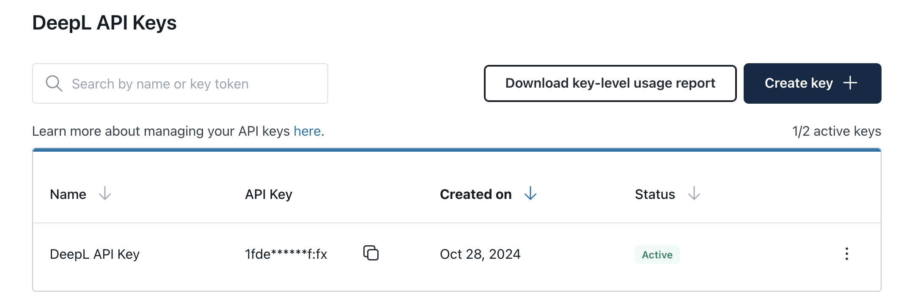
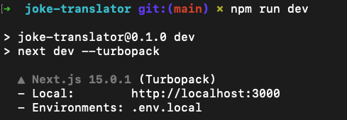
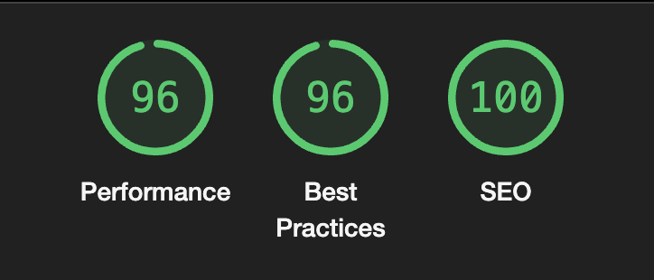
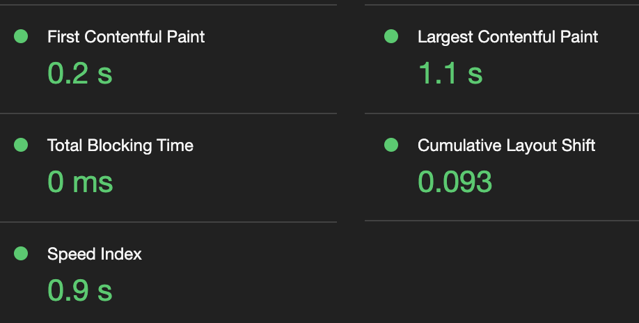
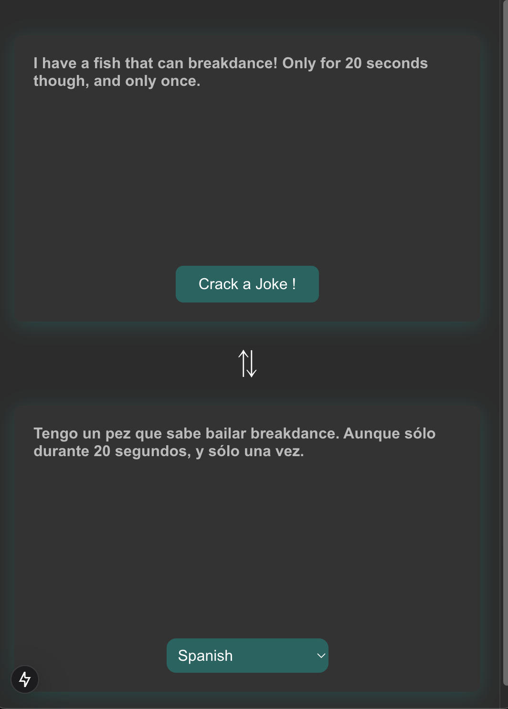
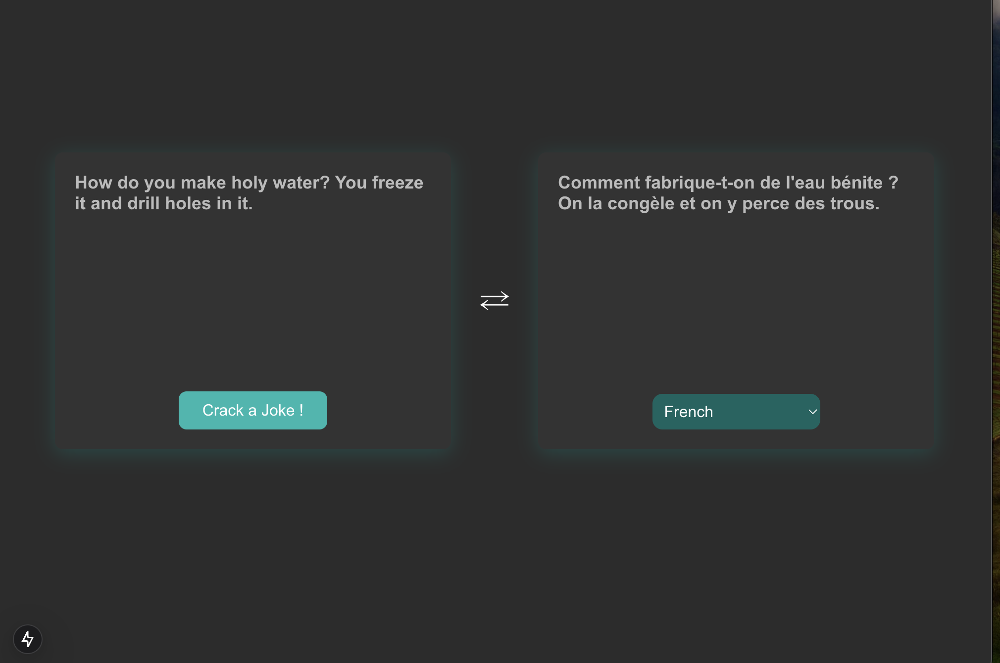

## 🌍 Overview
This is a [Next.js](https://nextjs.org) project that retrieves `Jokes` from one API and `translates` them using another API. The application features a 📱 responsive layout that adapts to different screen sizes, ensuring a user-friendly experience across various devices.

### 🛠️ Technologies Used
- [Next.js](https://nextjs.org): 

## 🚀 Getting Started

### 📋 Prerequisites
Ensure you have 🟢 Node.js installed on your machine. You can use either `npm` to manage dependencies. Node.js should be at least version 22 or higher to support all features used in this project.

### ⚙️ Installation
Clone the repository and install the necessary dependencies:
```bash
git clone https://github.com/shubhamchauhan4488/joke-translator.git
cd joke-translator
npm install --legacy-peer-deps // for some libraries like react-loading-skeleton are n
```
⚠️Note: the flag --legacy-peer-deps is only because `react-loading-skeleton` is currently not supported in react@18.

###  🏗️ Building the app
Before building the app, please do visit [DeepL](https://www.deepl.com/en/your-account/keys) to create your API key and store it in `.env.local` as:
```js
DEEPL_API_KEY=YOUR_DEEPL_API_KEY
```
In your DeepL account keys will be visible like this: 


Now, run
```bash
npm run build
```

### ▶️ Running the Development Server
To start the development server, run:

```bash
npm run dev
```
You will see the local dev server running in the CLI:


Open the server link from your CLI (most likely: [http://localhost:3000](http://localhost:3000)) to view the app. The app will automatically update whenever you make changes to the code.

## Project Structure
The main file for editing is located at `app/page.tsx`, where you can make changes to the page content. Any changes will automatically update, reflecting in the 🌐 during development.

### 📁 Directory Layout
- `app/`: Contains all the components and serves as the entry point for app router.
- `app/api` : Contains the nextjs - api routes.
- `ui/`: Has the containers that further house the re-usable components. Like Home, Joke and Translator.
- `ui/components/`: Stores reusable components used throughout the application, such as layout components, Jokes display, and translation components.
- `lib/hooks/`: Contains custom hooks that are used across the application.
- `lib/services/`: Contains the `api` integrations.
- `lib/context/`: Contains the app context shared amongst components.

## 📝 Approach and Design Decisions

### 🎯 Challenge Approach
The project is designed to provide an engaging and 📱 responsive user experience by integrating two distinct APIs: one for fetching Jokes and another for translating them. The core challenge was to ensure seamless integration of both APIs while maintaining a clean and intuitive user interface.

### 🛠️ Design Decisions
1. **🧩 Component-Based Architecture**: The application follows a component-based structure, making it easy to reuse components in the app as it grows. Each component is self-contained, which helps in maintaining the codebase and ensuring better separation of concerns.

2. **🔗 API integration (REST)**: Utility functions are created to handle API calls to keep the codebase clean and maintainable. These functions are located in the `lib/services/api` directory, allowing easy updates and ensuring that API logic is centralized, making debugging and testing simpler.

#### 🌐 APIs Used
1. **😂 Joke API**: Fetches random joke to display to the user.
   - URL: `https://api.jokeapi.dev/` (replace with the actual API URL used in your project).
   - Method: `GET`
   - Description: This API provides random joke in various categories, which can be filtered by type and language.

2. **🌍 Translation API**: Translates joke into a specified language.
   - URL: `https://api.translateapi.dev/` (replace with the actual API URL used in your project).
   - Method: `POST`
   - Payload: The joke `text` and `target language` for translation.
   - Description: The API takes the joke text as input and returns the translated version, allowing users to experience joke in their preferred language.

        ⚠️Note: This api needs an API_KEY in the environment variables. This is configured as `DEEPL_API_KEY` as explained above and is picked from the environment variables.

        #### Why REST?
        - Both ap handle straightforward requests and responses (like fetching a joke or translating text). REST’s well-established conventions (e.g., GET and POST requests) make these operations easy to understand and implement.
        - REST endpoints can leverage HTTP caching mechanisms more easily. For example, responses from `/jokes ` can be cached by CDNs or browsers, which reduces load on the server and speeds up response times.

3. **🔄 State Management (React Context API)**: The application uses the ⚛️ `React Context API` to manage global state, such as the fetched Jokes and its translation. This approach was chosen because it provides a straightforward way to share state across multiple components without the overhead of introducing a more complex state management library like Redux. The Context API is lightweight and well-suited for managing the application’s simple state needs.

4. **🎨 CSS-in-JS (styled-components)**: The project uses `styled-components` for styling. To provide scoped styles, ensuring that styles are component-specific, avoiding global scope pollution, and enabling dynamic styling based on props or state

5. **🔍 SEO and Performance**: The project leverages Next.js features like:
 - `SSR` helps in rendering pages on the server, ensuring faster page load times and better SEO, which is crucial for search engine visibility. 
 - `React Server Components` also contribute to improved performance by reducing the amount of JavaScript needed on the client-side, leading to quicker load times and a smoother user experience.
 - `Skeleton UI`: a loading skeleton is shown for when the `Joke` and its corresponding `Translation` will be fetched. This helps improve the web vitals.

### A `Lighthouse` report depicting the performance: 


### Web Vitals: 


6. **🔍 Security and Data Handling**: We are using NextJs - api routes because API routes run server-side, sensitive data and credentials can be handled securely without exposing them to the client, ensuring data safety. In our case, it is the API key that will be picked from the environment variables (local or hosted on cloud)

7. **🧪 Unit Testing(Vitest)**: The project uses `vitest` for unit testing. `vitest` is chosen for its speed and integration with modern JavaScript frameworks. It allows for fast and efficient testing, which helps developers get quick feedback during the development process.

8. **📱 Responsive Design (mobile-first)**: The layout is built using `flexbox`, with media queries to ensure the application looks good on all devices. This ensures that users have a consistent experience regardless of the device they use, whether it is a 💻, 📊, or 📱.

    Mobile:(veritcal layout)

    


    Laptop/Tabs (Horizontal Layout)

    


9. **🪝 Custom Hooks**: Custom hooks are used to encapsulate reusable logic, such as fetching translations in a useTransition. This makes the code more modular and easier to maintain, promoting code reusability and separation of concerns. Custom hooks help in avoiding redundant code and make it easier to implement complex logic in a reusable manner.

10. **⏳ Race conditions and API exploitation(Loading State)**: Loading State with Spinner or disabling the button while data is being fetched, provides a visual feedback during data loading. Example: Disabling a `dropdown` or showing a loading spinner on a `button`. This ensures that users are aware of the current state of the application, and block their attempt to induce race conditions and over-exploitation of resources.

11. **🔴 Error Handling/State(Error Boundary)**: Used the Error Boundary for useTransition is currently only available in React’s canary and experimental channels.

12. **⚡ DevX(HMR/Turbopack/App Router)**:
- *HMR*: NextJs provides HMR out-of-the-box for improved DX.
- *Turbopack*: New release from NextJs in Next@15 to replace Webpack and reduce build times.
- *App Router*: Provides nested layouts and server components, enabling more flexibility in defining complex layouts and route-based data fetching.

13. Responsive Design

### 🔄 Example Workflow
1. **Joke Fetch a Joke**: A button on the main page fetches a random Joke from the Joke API.
2. **🌍 Translate the Joke**: After the Joke is displayed, users have an option to translate the Joke into their desired language using the Translate API. By default, the joke will be fetched in `Spanish` when the app is loaded and in `last language selection` from user if user had changed the `language` before asking for another `Joke`.
